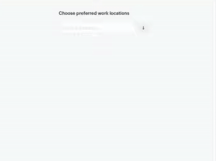
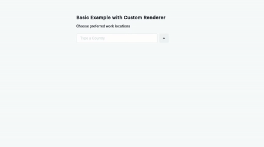

# Chakra-UI AutoComplete

> An Accessible Autocomplete Utility for [Chakra UI](github.com/chakra-ui/chakra-ui) that composes [Downshift](https://github.com/downshift-js/downshift) ComboBox

[](https://www.npmjs.com/package/chakra-ui-autocomplete) [](https://standardjs.com)



## Install

**Warning* This Package is still WIP at the Moment and there might be some missing features

```bash
npm install --save chakra-ui-autocomplete
```

## Usage

- Usage Example with TSX/Typescript

```tsx
import React from 'react'
import { CUIAutoComplete } from 'chakra-ui-autocomplete'


export interface Item {
  label: string;
  value: string;
}
const countries = [
  { value: "ghana", label: "Ghana" },
  { value: "nigeria", label: "Nigeria" },
  { value: "kenya", label: "Kenya" },
  { value: "southAfrica", label: "South Africa" },
  { value: "unitedStates", label: "United States" },
  { value: "canada", label: "Canada" },
  { value: "germany", label: "Germany" }
];

export default function App() {
  const [pickerItems, setPickerItems] = React.useState(countries);
  const [selectedItems, setSelectedItems] = React.useState<Item[]>([]);

  const handleCreateItem = (item: Item) => {
    setPickerItems((curr) => [...curr, item]);
    setSelectedItems((curr) => [...curr, item]);
  };

  const handleSelectedItemsChange = (selectedItems?: Item[]) => {
    if (selectedItems) {
      setSelectedItems(selectedItems);
    }
  };

  return (
        <CUIAutoComplete
          label="Choose preferred work locations"
          placeholder="Type a Country"
          onCreateItem={handleCreateItem}
          items={pickerItems}
          selectedItems={selectedItems}
          onSelectedItemsChange={(changes) =>
            handleSelectedItemsChange(changes.selectedItems)
          }
        />
  );
}
```

---

- Usage Example with JSX/Javascript

```jsx
import React from 'react'
import { CUIAutoComplete } from 'chakra-ui-autocomplete'

const countries = [
  { value: "ghana", label: "Ghana" },
  { value: "nigeria", label: "Nigeria" },
  { value: "kenya", label: "Kenya" },
  { value: "southAfrica", label: "South Africa" },
  { value: "unitedStates", label: "United States" },
  { value: "canada", label: "Canada" },
  { value: "germany", label: "Germany" }
];

export default function App() {
  const [pickerItems, setPickerItems] = React.useState(countries);
  const [selectedItems, setSelectedItems] = React.useState([]);

  const handleCreateItem = (item) => {
    setPickerItems((curr) => [...curr, item]);
    setSelectedItems((curr) => [...curr, item]);
  };

  const handleSelectedItemsChange = (selectedItems) => {
    if (selectedItems) {
      setSelectedItems(selectedItems);
    }
  };

  return (
        <CUIAutoComplete
          label="Choose preferred work locations"
          placeholder="Type a Country"
          onCreateItem={handleCreateItem}
          items={pickerItems}
          selectedItems={selectedItems}
          onSelectedItemsChange={(changes) =>
            handleSelectedItemsChange(changes.selectedItems)
          }
        />
  );
}
```

### Usage Example with Custom Item Renderer




```jsx
import React from 'react'
import { Text, Flex, Avatar } from '@chakra-ui/react'
import { CUIAutoComplete } from 'chakra-ui-autocomplete'


const countries = [
  { value: "ghana", label: "Ghana" },
  { value: "nigeria", label: "Nigeria" },
  { value: "kenya", label: "Kenya" },
  { value: "southAfrica", label: "South Africa" },
  { value: "unitedStates", label: "United States" },
  { value: "canada", label: "Canada" },
  { value: "germany", label: "Germany" }
];

export default function App() {
  const [pickerItems, setPickerItems] = React.useState(countries);
  const [selectedItems, setSelectedItems] = React.useState([]);

  const handleCreateItem = (item) => {
    setPickerItems((curr) => [...curr, item]);
    setSelectedItems((curr) => [...curr, item]);
  };

  const handleSelectedItemsChange = (selectedItems) => {
    if (selectedItems) {
      setSelectedItems(selectedItems);
    }
  };

  const customRender = (selected) => {
    return (
      <Flex flexDir="row" alignItems="center">
        <Avatar mr={2} size="sm" name={selected.label} />
        <Text>{selected.label}</Text>
      </Flex>
    )
  }


  return (
          <CUIAutoComplete
            tagStyleProps={{
              rounded: 'full'
            }}
            label="Choose preferred work locations"
            placeholder="Type a Country"
            onCreateItem={handleCreateItem}
            items={pickerItems}
            itemRenderer={customRender}
            selectedItems={selectedItems}
            onSelectedItemsChange={(changes) =>
              handleSelectedItemsChange(changes.selectedItems)
            }
          />
  );
}

```

## Props

| Property               | Type     | Required | Decscription                                                                                                                                                     |
| ---------------------- | -------- | -------- | ---------------------------------------------------------------------------------------------------------------------------------------------------------------- |
| items                  | Array    | Yes      | An array of the items to be selected within the input field                                                                                                      |
| placeholder            | string   |          | The placeholder for the input field                                                                                                                              |
| label                  | string   | Yes      | Input Form Label to describe the activity or process                                                                                                             |
| highlightItemBg        | string   |          | For accessibility, you can define a custom color for the highlight color when user is typing also accept  props like `yellow.300` based on chakra theme provider |
| onCreateItem           | Function | Yes      | Function to handle creating new Item                                                                                                                             |
| optionFilterFunc       | Function | Yes      | You can define a custom Function to handle filter logic                                                                                                          |
| itemRenderer           | Function |          | Custom Function that can either return a JSX Element or String, in order to control how the list items within the Dropdown is rendered                           |
| labelStyleProps        | Object   |          | Custom style props based on chakra-ui for labels, Example `{{ bg: 'gray.100', pt: '4'}}                                                                          |
| inputStyleProps        | Object   |          | Custom style props based on chakra-ui for input field, Example`{{ bg: 'gray.100', pt: '4'}}                                                                      |
| toggleButtonStyleProps | Object   |          | Custom style props based on chakra-ui for toggle button, Example `{{ bg: 'gray.100', pt: '4'}}                                                                   |
| tagStyleProps          | Object   |          | Custom style props based on chakra-ui for multi option tags, Example`{{ bg: 'gray.100', pt: '4'}}                                                                |
| listStyleProps         | Object   |          | Custom style props based on chakra-ui for dropdown list, Example `{{ bg: 'gray.100', pt: '4'}}                                                                   |
| listItemStyleProps     | Object   |          | Custom style props based on chakra-ui for single list item in dropdown, Example`{{ bg: 'gray.100', pt: '4'}}                                                     |
| selectedIconProps      | Object   |          | Custom style props based on chakra-ui for the green tick icon in dropdown list, Example `{{ bg: 'gray.100', pt: '4'}}                                            |
| icon      | Object   |   CheckCircleIcon       | @chakra-ui/icons Icon to be displayed instead of CheckCircleIcon                                            |

## Todo

- [ ] Add Combobox Support for Single Select [Downshift Combobox](https://downshift.netlify.app/use-combobox)
- [x] Multi Select Support
- [x] Feature to Create when not in list
- [x] Add prop for Items Renderer to enable rendering of React Element
- [ ] Ability to define `chakra-ui components` that will render in place of `Tags, MenuList, TextInput, Form Label` will check render props or headless UI patterns.

## License

MIT © [koolamusic](https://github.com/koolamusic)
